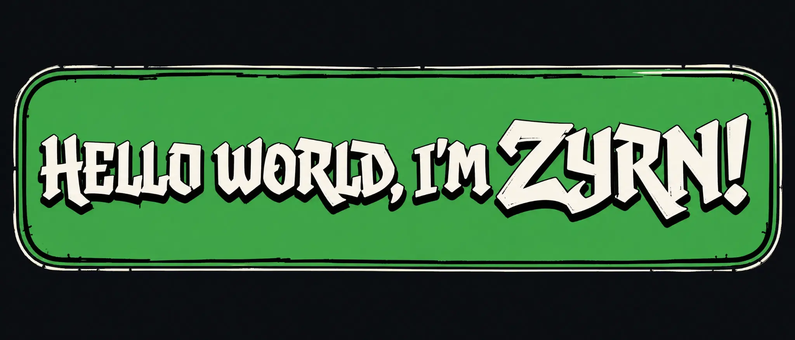

<p align="center">
  
</p>

# Zyrn.io


> **4+ years in code — self-taught from curiosity, sharpened by shipping.**
>
> I learned by building things that did not work yet, following the failure all the way down, and returning with a better version. I work across languages and ecosystems because every tool teaches a different way to think — and every project deserves the right one.

[**repositories**](https://github.com/OdixCodez?tab=repositories) · [**Zyrn UI**](https://github.com/OdixCodez/Zyrn-UI) · [**Vortex**](https://github.com/OdixCodez/Vortex)

---

## // SELF-TAUGHT, IN PRACTICE

| signal | what it means |
| --- | --- |
| **No prescribed route** | I built my own foundation through projects, documentation, debugging, and repetition. |
| **Polyglot by design** | I learn languages to expand the ways I can solve problems, not to collect labels. |
| **Four-plus years of mileage** | The experience came from building, breaking, refactoring, and coming back with more context. |
| **Craft over comfort** | I will choose the right tool for the work, even when that means learning something unfamiliar first. |

```diff
+ build the first version
+ trace the system until the failure makes sense
+ turn the lesson into the next project
- stay inside one stack just because it is familiar
```

## // LANGUAGE RACK

**Core languages**

<p>
  
  
  
  
  
</p>

**Frameworks, runtimes, and tools**

<p>
  
  
  
  
  
</p>

> **The stack changes. The instinct stays the same:** understand the system, make the tradeoff, ship the work.

## // WORK ON THE WALL

| project | artifact | stack |
| --- | --- | --- |
| [**Zyrn UI**](https://github.com/OdixCodez/Zyrn-UI) | Expressive and accessible UI primitives, themes, tokens, and motion with a sharp visual identity. | TypeScript · React |
| [**Vortex**](https://github.com/OdixCodez/Vortex) | A cross-platform object-oriented shell with a native pipeline, familiar aliases, and live process monitoring. | C# · .NET 9 |
| [**Simple ChatBot**](https://github.com/OdixCodez/Simple-ChatBot) | An experiment in conversational interfaces and application flow. | TypeScript |
| [**Kairo Themes**](https://github.com/OdixCodez/Kairo--Themes) | Dark and light themes for the editor where the work gets done. | VS Code |

## // CURRENT ARC

Right now I am sharpening the range: stronger interface systems, better developer tools, unfamiliar runtimes, and projects that require more than one language to become real.

```text
╲╱  no template. no borrowed persona. just mileage.  ╲╱
```
